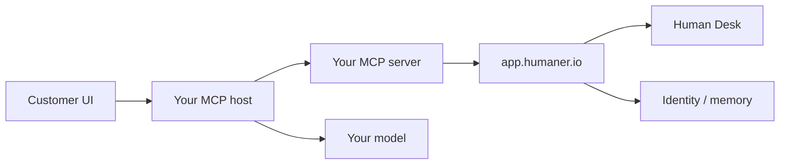

# Humaner Cloud | MCP / BYO agent

Connect **your own agent** to the Humaner Cloud framework. You keep the model, tools, and rules. Cloud keeps Desk, tickets, visitor identity, memory hooks, and the same Widget / React / API surfaces.

This is not Self-Host. You do not fork the repo or set `DATABASE_URL`. Base URL is always `https://app.humaner.io`.

If you want to run the dashboard yourself (BYO LLM on your origin), stop and use [`SELFHOST.md`](./SELFHOST.md).

---

## What you are building

An **MCP server** (or a headless client that speaks the same REST contracts) that:

1. Answers with **your** model (Claude, GPT, a local runtime, LangGraph, …).
2. Calls Humaner Cloud when it needs the framework: agent config, visitor identity, Desk tickets, proactive widget pops.
3. Optionally streams through Cloud Intelligence (`POST /api/v1/chat`) when you want Humaner's retrieval + memory instead of your own.

| Layer          | Your job                                   | Cloud job                                                         |
| -------------- | ------------------------------------------ | ----------------------------------------------------------------- |
| Inference      | Run the model. Decide when to escalate.    | Optional: `POST /api/v1/chat` if you want managed Intelligence    |
| Prompt / tools | System prompt, MCP tools, guardrails       | Agent greeting, persona, Skills, knowledge (when you use `/chat`) |
| Customer UI    | Custom chat, or keep Widget / React / Link | Embed script, SDK, hosted link                                    |
| Identity       | Pass a hashed `visitorId`                  | Cross-session memory (Frontier+)                                  |
| Handoff        | Emit escalate + summary + urgency          | Human Desk ticket, routing, live chat (tiered)                    |

Two valid shapes:

| Shape                  | When to use                                                                                         |
| ---------------------- | --------------------------------------------------------------------------------------------------- |
| **BYO inference**      | You own replies. Cloud is Desk + identity + embeds. Default for an MCP / custom agent.              |
| **Cloud Intelligence** | You want Humaner's RAG, memory, and personas. Your MCP server is a thin client over `/api/v1/chat`. |

---

## Prerequisites

- A Humaner Cloud workspace at [app.humaner.io](https://app.humaner.io)
- An agent (Dashboard → Agents → New). Copy the **public Agent ID**
- **Frontier or higher** for REST API access (`hm_live_…` keys)
- Node.js 20+ if you follow the TypeScript server below
- Allowed domains on the agent if the Widget / React / Link will load in a browser

Create the API key: **Dashboard → Settings → API** (or Integrations → REST API). Shown once. Store it as `HUMANER_API_KEY`. Never put it in the browser.

```bash
HUMANER_BASE_URL=https://app.humaner.io
HUMANER_API_KEY=hm_live_xxxxxxxx
HUMANER_AGENT_ID=YOUR_AGENT_PUBLIC_ID
```

---

## Architecture



- **MCP host**: Claude Desktop, Cursor, Claude Code, or your own process that implements the [Model Context Protocol](https://modelcontextprotocol.io).
- **MCP server**: small process you write. It exposes tools. Tools call Cloud.
- **Cloud**: `https://app.humaner.io/api/v1/*` with `Authorization: Bearer hm_live_…`.

Widget / React / Link stay Agent-ID-only. They talk to Cloud from the browser via Origin + allowlist. Your MCP server is **server-side**. Same org, same agent, different auth.

---

## 1. Cloud dashboard (human steps)

1. Sign up at [app.humaner.io/auth/signup](https://app.humaner.io/auth/signup) and create an organization.
2. **Agents → New.** Add site URL, docs, or FAQ as knowledge if you will use Cloud Intelligence.
3. Copy the public Agent ID from **Agents → your agent → Integrations**. That is `HUMANER_AGENT_ID`.
4. **Settings → API** → create a key. That is `HUMANER_API_KEY`.
5. If you embed the widget: **Integrations → Widget → Allowed domains**. Add every hostname that will load chat (`example.com`, `www.example.com`). Leave empty only while testing on localhost.

---

## 2. Scaffold the MCP server

```bash
mkdir humaner-mcp && cd humaner-mcp
npm init -y
npm install @modelcontextprotocol/sdk zod
npm install -D typescript @types/node
npx tsc --init --target ES2022 --module Node16 --moduleResolution Node16 --outDir dist
```

Create `src/humaner.ts`. Thin HTTP client. No secrets in logs.

```ts
const BASE = process.env.HUMANER_BASE_URL ?? "https://app.humaner.io";
const API_KEY = process.env.HUMANER_API_KEY;
const AGENT_ID = process.env.HUMANER_AGENT_ID;

if (!API_KEY || !AGENT_ID) {
  throw new Error("Set HUMANER_API_KEY and HUMANER_AGENT_ID");
}

async function humaner<T>(
  path: string,
  init: RequestInit & { json?: unknown } = {},
): Promise<T> {
  const { json, ...rest } = init;
  const res = await fetch(`${BASE}${path}`, {
    ...rest,
    headers: {
      Authorization: `Bearer ${API_KEY}`,
      "Content-Type": "application/json",
      ...rest.headers,
    },
    body: json === undefined ? rest.body : JSON.stringify(json),
  });
  if (!res.ok) {
    const text = await res.text();
    throw new Error(`Humaner ${res.status}: ${text}`);
  }
  if (res.headers.get("content-type")?.includes("text/event-stream")) {
    return res as T;
  }
  return (await res.json()) as T;
}

export function getAgent() {
  return humaner<{
    id: string;
    name: string;
    role: string;
    character: string;
    greeting: string;
  }>(`/api/v1/agents/${AGENT_ID}`);
}

export function identifyVisitor(input: {
  sessionId: string;
  visitorId: string;
}) {
  return humaner<{ ok: boolean; applied: boolean; visitorId: string }>(
    "/api/v1/visitors/identify",
    {
      method: "POST",
      json: { agentId: AGENT_ID, ...input },
    },
  );
}

export function createTicket(input: {
  visitorEmail: string;
  sessionId?: string;
  note?: string;
  subject?: string;
  visitorFirstName?: string;
  visitorLastName?: string;
  visitorCompany?: string;
  history?: { role: "user" | "assistant"; content: string }[];
}) {
  return humaner<{
    ok: boolean;
    ticketId: string;
    liveChat: { enabled: boolean };
  }>("/api/v1/handoff/ticket", {
    method: "POST",
    json: { agentId: AGENT_ID, ...input },
  });
}

export function proactive(input: { visitorId: string; message: string }) {
  return humaner<{
    id: string;
    visitorId: string;
    message: string;
    expiresAt: string;
  }>("/api/v1/widget/proactive", {
    method: "POST",
    json: { agentId: AGENT_ID, ...input },
  });
}

/** Cloud Intelligence path. Omit if you own inference. */
export async function cloudChat(input: {
  message: string;
  sessionId?: string;
  visitorId?: string;
}): Promise<{ text: string; raw: unknown }> {
  const res = await fetch(`${BASE}/api/v1/chat`, {
    method: "POST",
    headers: {
      Authorization: `Bearer ${API_KEY}`,
      "Content-Type": "application/json",
    },
    body: JSON.stringify({ agentId: AGENT_ID, ...input }),
  });
  if (!res.ok) {
    throw new Error(`Humaner chat ${res.status}: ${await res.text()}`);
  }
  const reader = res.body?.getReader();
  if (!reader) throw new Error("Empty chat stream");
  const decoder = new TextDecoder();
  let text = "";
  let raw: unknown = null;
  let buf = "";
  while (true) {
    const { done, value } = await reader.read();
    if (done) break;
    buf += decoder.decode(value, { stream: true });
    const parts = buf.split("\n\n");
    buf = parts.pop() ?? "";
    for (const part of parts) {
      const line = part.replace(/^data:\s*/, "").trim();
      if (!line || line === "[DONE]") continue;
      const ev = JSON.parse(line) as {
        delta?: string;
        usage?: unknown;
        metadata?: unknown;
        handoff?: unknown;
        suggestions?: unknown;
      };
      if (typeof ev.delta === "string") text += ev.delta;
      if (ev.usage || ev.metadata) raw = ev;
    }
  }
  return { text, raw };
}

export { AGENT_ID };
```

Create `src/server.ts`. Tools map 1:1 to Cloud endpoints.

```ts
import { McpServer } from "@modelcontextprotocol/sdk/server/mcp.js";
import { StdioServerTransport } from "@modelcontextprotocol/sdk/server/stdio.js";
import { z } from "zod";

import {
  AGENT_ID,
  cloudChat,
  createTicket,
  getAgent,
  identifyVisitor,
  proactive,
} from "./humaner.js";

const server = new McpServer({
  name: "humaner-cloud",
  version: "1.0.0",
});

server.tool(
  "humaner_get_agent",
  "Fetch the Cloud agent greeting, name, and persona. Call once per session.",
  {},
  async () => {
    const agent = await getAgent();
    return { content: [{ type: "text", text: JSON.stringify(agent) }] };
  },
);

server.tool(
  "humaner_identify_visitor",
  "Attach a stable hashed visitor id so Cloud memory follows the person. Never send raw email as visitorId.",
  {
    sessionId: z.string().describe("Anonymous session used so far"),
    visitorId: z.string().describe("Hashed stable user id"),
  },
  async ({ sessionId, visitorId }) => {
    const out = await identifyVisitor({ sessionId, visitorId });
    return { content: [{ type: "text", text: JSON.stringify(out) }] };
  },
);

server.tool(
  "humaner_create_ticket",
  "Escalate to Human Desk. Use when you cannot resolve, the customer asks for a human, or the issue is billing / access / safety.",
  {
    visitorEmail: z.string().email(),
    sessionId: z.string().optional(),
    note: z.string().max(4000).optional(),
    subject: z.string().max(255).optional(),
    visitorFirstName: z.string().optional(),
    visitorLastName: z.string().optional(),
    visitorCompany: z.string().optional(),
    history: z
      .array(
        z.object({
          role: z.enum(["user", "assistant"]),
          content: z.string(),
        }),
      )
      .optional()
      .describe("Last 12 turns. Cloud summarizes subject and urgency."),
  },
  async (input) => {
    const out = await createTicket(input);
    return { content: [{ type: "text", text: JSON.stringify(out) }] };
  },
);

server.tool(
  "humaner_proactive",
  "Queue a teaser on the live widget for an identified visitor.",
  {
    visitorId: z.string(),
    message: z.string().max(280),
  },
  async (input) => {
    const out = await proactive(input);
    return { content: [{ type: "text", text: JSON.stringify(out) }] };
  },
);

server.tool(
  "humaner_cloud_chat",
  `Optional. Send a turn through Humaner Cloud Intelligence for agent ${AGENT_ID}. Use when you want Cloud RAG and memory instead of your own model.`,
  {
    message: z.string().max(4000),
    sessionId: z.string().optional(),
    visitorId: z.string().optional(),
  },
  async (input) => {
    const out = await cloudChat(input);
    return { content: [{ type: "text", text: JSON.stringify(out) }] };
  },
);

const transport = new StdioServerTransport();
await server.connect(transport);
```

`package.json` scripts:

```json
{
  "type": "module",
  "scripts": {
    "build": "tsc",
    "start": "node dist/server.js"
  }
}
```

```bash
npm run build
```

Do not write MCP logs to stdout. Stdio is the protocol. Use stderr if you must log.

---

## 3. Tool catalog

These are the Cloud endpoints your server should expose. Do not invent others.

| MCP tool                   | Cloud endpoint                   | Purpose                                    |
| -------------------------- | -------------------------------- | ------------------------------------------ |
| `humaner_get_agent`        | `GET /api/v1/agents/{publicId}`  | Greeting, name, persona                    |
| `humaner_identify_visitor` | `POST /api/v1/visitors/identify` | Merge session → hashed visitor (Frontier+) |
| `humaner_create_ticket`    | `POST /api/v1/handoff/ticket`    | Human Desk ticket                          |
| `humaner_proactive`        | `POST /api/v1/widget/proactive`  | Widget teaser for an identified visitor    |
| `humaner_cloud_chat`       | `POST /api/v1/chat`              | Optional. Managed Intelligence over SSE    |

Auth on every call:

```text
Authorization: Bearer hm_live_xxxxxxxx
Content-Type: application/json
```

Errors are `{ "error": "message" }`. 401 = bad or missing key. 403 = key/org mismatch or Human Desk off. 429 = back off (`Retry-After`). Full table: [docs.humaner.io/reference/errors](https://docs.humaner.io/reference/errors).

Rate limits (chat and handoff, independent): 30 / IP / 60s, 20 / session / 60s, 120 / agent / 60s.

---

## 4. BYO inference (your model)

Keep `humaner_cloud_chat` **off** the tool list if you own replies. Your host already has a model.

System prompt sketch (give this to your agent, not to Cloud):

```text
You are a customer-support agent for {company}.
Use humaner_get_agent once to match the Cloud greeting and name.
If the visitor is logged in, call humaner_identify_visitor with a hashed id.
Answer from the tools and knowledge you have.
If you cannot resolve, the customer asks for a human, or the topic is
billing / account lockout / safety / refunds you cannot execute:
call humaner_create_ticket with visitorEmail, a short note, and the last turns.
Never put raw email, phone, or tokens in visitorId.
Never expose HUMANER_API_KEY.
```

Persist `sessionId` across turns in your host. Pass the same id to identify and to ticket `history`.

When you escalate, Cloud summarizes the last 12 `{ role, content }` turns into subject + urgency. Send them.

API-created tickets are **email follow-up**. `liveChat.enabled` is false on this path. Live chat is a widget-issued ticket on Cloud.

---

## 5. Cloud Intelligence (optional)

Use `humaner_cloud_chat` when you want Humaner's Hybrid RAG, personas, Skills, and memory instead of your own model.

SSE shape:

```text
data: {"delta":"Your order "}

data: {"delta":"shipped."}

data: {"usage":{...},"metadata":{...},"handoff":null,"suggestions":["..."]}

data: [DONE]
```

On the final event:

| Field               | Action                                       |
| ------------------- | -------------------------------------------- |
| `usage.sessionId`   | Persist for the next turn                    |
| `metadata.escalate` | `true` → create a ticket or show handoff UI  |
| `metadata.urgency`  | `low` \| `medium` \| `high` \| `critical`    |
| `handoff`           | `{ humanDesk, email }` when escalate is true |
| `suggestions`       | Optional quick-reply chips                   |

If `metadata.escalate` is true and you are not in the widget, call `humaner_create_ticket` yourself.

---

## 6. Point a host at the server

### Cursor

`~/.cursor/mcp.json` (or project `.cursor/mcp.json`):

```json
{
  "mcpServers": {
    "humaner-cloud": {
      "command": "node",
      "args": ["C:/path/to/humaner-mcp/dist/server.js"],
      "env": {
        "HUMANER_BASE_URL": "https://app.humaner.io",
        "HUMANER_API_KEY": "hm_live_xxxxxxxx",
        "HUMANER_AGENT_ID": "YOUR_AGENT_PUBLIC_ID"
      }
    }
  }
}
```

### Claude Desktop

`claude_desktop_config.json`:

```json
{
  "mcpServers": {
    "humaner-cloud": {
      "command": "node",
      "args": ["/absolute/path/humaner-mcp/dist/server.js"],
      "env": {
        "HUMANER_BASE_URL": "https://app.humaner.io",
        "HUMANER_API_KEY": "hm_live_xxxxxxxx",
        "HUMANER_AGENT_ID": "YOUR_AGENT_PUBLIC_ID"
      }
    }
  }
}
```

Restart the host. Confirm tools: `humaner_get_agent`, `humaner_identify_visitor`, `humaner_create_ticket`.

### Headless (no MCP host)

Skip MCP. Call the same REST helpers from your bot process. Contracts do not change.

---

## 7. Customer surfaces (optional)

The MCP server does not replace the widget. If customers should chat on your site, embed Cloud as usual. Origin must match Allowed domains. No API key in the page.

**Widget**

```html
<script
  src="https://app.humaner.io/widget.js"
  data-agent="YOUR_AGENT_PUBLIC_ID"
  data-position="bottom-right"
  async
></script>
```

Use `data-agent`, not `data-agent-id`.

**React**

```tsx
import { HumanerChat } from "@humaner/react";

<HumanerChat agentId="YOUR_AGENT_PUBLIC_ID" position="bottom-right" />;
```

Do not set `baseUrl` on Cloud. It defaults to `https://app.humaner.io`.

**Link**

```text
https://app.humaner.io/widget/YOUR_AGENT_PUBLIC_ID?open=1
```

Identify after login (hashed id only):

```js
window.Humaner?.identify?.(hashedUserId, { plan: "pro" });
```

Widget chat uses Cloud Intelligence. BYO inference is your MCP host or a custom UI that you build. Same Desk when you call `POST /api/v1/handoff/ticket`.

---

## 8. Handoff payload

Direct ticket (MCP / custom UI):

```bash
curl -X POST https://app.humaner.io/api/v1/handoff/ticket \
  -H "Authorization: Bearer hm_live_xxxxxxxx" \
  -H "Content-Type: application/json" \
  -d '{
    "agentId": "YOUR_AGENT_PUBLIC_ID",
    "visitorEmail": "customer@example.com",
    "sessionId": "sess_abc123",
    "note": "Customer cannot access account after password reset.",
    "history": [
      { "role": "user", "content": "I cannot log in after the reset email." },
      { "role": "assistant", "content": "I could not reset it from here." }
    ]
  }'
```

200:

```json
{
  "ok": true,
  "ticketId": "tkt_abc123",
  "liveChat": { "enabled": false }
}
```

If you stream Cloud chat yourself, the widget-style final event looks like:

```json
{
  "delta": "",
  "done": true,
  "escalate": true,
  "handoff": {
    "humanDesk": true,
    "urgency": "high",
    "conversationSummary": "Customer cannot access account after password reset."
  }
}
```

Human Desk must be enabled on the organization or the ticket route returns 403.

---

## 9. Security

| Check                           | Why                                                           |
| ------------------------------- | ------------------------------------------------------------- |
| API key only on the MCP process | Browser embeds use Agent ID + Origin                          |
| Hashed `visitorId`              | Memory without putting PII in the id                          |
| Org-scoped key                  | A key only touches one workspace                              |
| Domain allowlist                | Stops other sites from embedding the Agent ID                 |
| No key in git                   | Use the host env block, not committed `.env` in a public repo |
| 4,000 char message cap          | Cloud rejects larger chat and ticket notes                    |

Report vulnerabilities to [dev@humaner.io](mailto:dev@humaner.io). Do not file public issues for exploitable findings.

---

## 10. Verification

1. `humaner_get_agent` returns name + greeting for your Agent ID.
2. Send a test turn from the MCP host. Persist `sessionId`.
3. `humaner_identify_visitor` with a fake hashed id → `{ "ok": true, "applied": true }` on Frontier+.
4. Force a human (`humaner_create_ticket`) → ticket appears under **Desk → Human Desk**.
5. If you embedded the widget: bubble loads, allowlist matches the hostname, a knowledge question answers.
6. 401 → key wrong. 403 → plan / org / Desk off / origin. 404 → Agent ID.

---

## Cloud vs Self-Host vs this guide

|                | This guide (MCP / BYO on Cloud)  | Cloud Agent Brief    | Self-Host                    |
| -------------- | -------------------------------- | -------------------- | ---------------------------- |
| Host           | `app.humaner.io`                 | `app.humaner.io`     | Your origin                  |
| Who answers    | Your model (or optional `/chat`) | Humaner Intelligence | Your LLM key + starter agent |
| What you write | MCP server + tools               | Embed only           | Deploy dashboard             |
| Desk           | Cloud Human Desk                 | Cloud Human Desk     | Helpdesk on your DB          |
| Memory / RAG   | Cloud if you call `/chat`        | Automatic            | `data/knowledge/`            |

- Embed-only Cloud: [docs.humaner.io/agent-brief](https://docs.humaner.io/agent-brief)
- Self-Host A→Z: [`SELFHOST.md`](./SELFHOST.md)
- API reference: [docs.humaner.io/reference](https://docs.humaner.io/reference)

---

## Deep links

- [Quickstart (Cloud)](https://docs.humaner.io/quickstart)
- [Authentication](https://docs.humaner.io/reference/authentication)
- [Chat](https://docs.humaner.io/reference/chat)
- [Handoff](https://docs.humaner.io/reference/handoff)
- [Identify](https://docs.humaner.io/reference/identify)
- [Self-hosting vs Cloud](https://docs.humaner.io/contributing/open-source-vs-cloud)
- [MCP specification](https://modelcontextprotocol.io)
