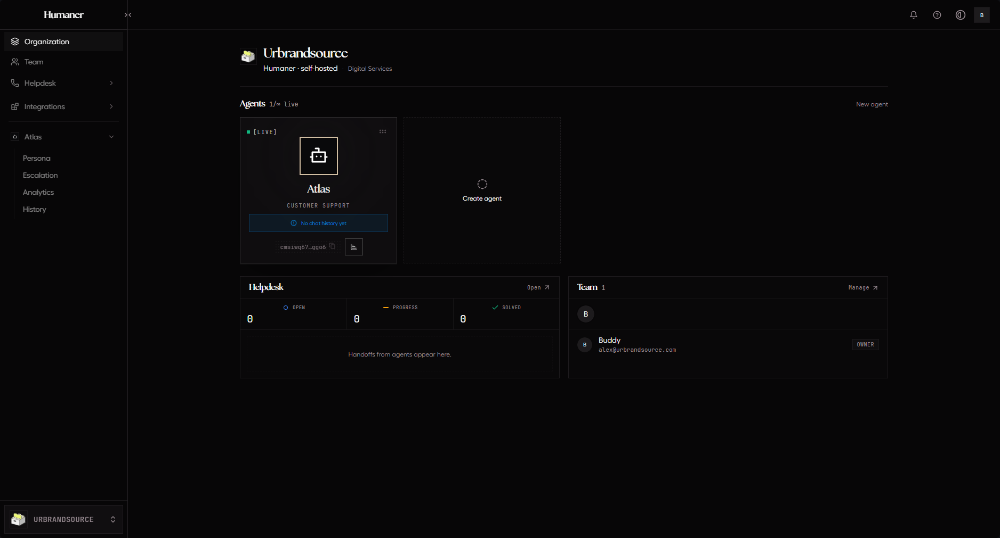

<p align="center">
  <h1 align="center"><b>Humaner</b></h1>
  <p align="center">
    Self-host customer support | Agents, Helpdesk, and Team management.
    <br />
    <br />
    <a href="https://humaner.io"><strong>Website</strong></a>
    ·
    <a href="https://docs.humaner.io/oss"><strong>Docs</strong></a>
    ·
    <a href="https://github.com/Humaner-inc/humaner/issues"><strong>Issues</strong></a>
  </p>
</p>

## About Humaner Self-Host

Humaner Self-Host is a free **customer-support kit**: Humaner infra with BYO agent to run support, escalation, ticketing and manage team members.  
Your agent is onboarded like a real employee through [Industry Skillz](https://github.com/Humaner-inc/customer-support-skillz) | Simply add your own Custom prompt and knowledge.

This repository do not include Humaner Intelligence, Agent Desk, clusters, live chat or Inboxes from [Humaner Cloud](https://app.humaner.io).

## Features

**Starter agent**: Your Custom system prompt, Industry Skillz, markdown knowledge (`data/knowledge/`), and BYO LLM (whatever you want).

**Helpdesk**: Async tickets, urgency, assignees | Handoffs from agents land in a ticket dashboard for your team.

**Organization & team**: Multi-workspace orgs, members, and RBAC under the Humaner product brand.

---

## Integrations

**Widget embed**: One-line script with domain allowlist and visitor identify.

**React SDK**: Drop-in `<HumanerChat />` with the same auth model as the widget.

**REST API**: SSE chat stream and agent metadata for custom clients.

## Get started

Clone → workable support workspace in minutes: follow the A→Z guide in `[SELF_HOST.md](./SELF_HOST.md)`

Paste the [Self-hosting — Agent Brief](https://docs.humaner.io/oss/agent-brief) to your IDE Agent.

```bash
git clone https://github.com/Humaner-inc/humaner.git
cd humaner
pnpm install
cp apps/dashboard/.env.example apps/dashboard/.env.local
# fill DATABASE_URL, AUTH_SECRET, NEXT_PUBLIC_APP_URL, LLM API KEY
pnpm --filter @humaner/dashboard exec prisma migrate dev
pnpm --filter @humaner/dashboard dev
```

Open [http://localhost:3001](http://localhost:3001) · set `NEXT_PUBLIC_DEPLOYMENT_MODE=oss`.

[Self-Host setup →](./SELF_HOST.md) · [Agent brief →](https://docs.humaner.io/oss/agent-brief) · [OSS docs →](https://docs.humaner.io/oss)

## Architecture

- Monorepo
- pnpm
- React
- TypeScript
- Next.js
- PostgreSQL (pgvector)
- Prisma
- Tailwind CSS
- shadcn/ui

### Hosting

- PostgreSQL 16+ with pgvector (database)
- Your host for the dashboard (Vercel, Docker, VM, etc.)
- Optional SMTP for sign-up verification email

### Services

- Anthropic or OpenAI (BYO LLM for agent chat)
- Resend or SMTP (transactional email)

```
apps/
  dashboard/      → Self-Host app (port 3001)
  documentation/  → docs (OSS pages)
packages/
  react/          → @humaner/react
  shared/         → plans, URLs, shared types
```

## Self-Host vs Humaner Cloud

| Self-Host (this repo)                                   | Humaner Cloud                                       |
| ------------------------------------------------------- | --------------------------------------------------- |
| Self-Host dashboard (`NEXT_PUBLIC_DEPLOYMENT_MODE=oss`) | Hosted `app.humaner.io`                             |
| Custom prompt · Industry Skillz · markdown KB · BYO LLM | Inboxes · Cross-Session memory · Auto-training loop |
| Helpdesk, org/team, Widget / React / API                | Agent Desk · Runbooks · Live Chat handle            |
| No Polar / plan gates                                   | Polar billing · quotas · paid personas              |

Details: `[Docs/OPEN_SOURCING.md](./Docs/OPEN_SOURCING.md)` · `[SELF_HOST.md](./SELF_HOST.md)`

## Brand tokens

| Token  | Hex       | Use                              |
| ------ | --------- | -------------------------------- |
| White  | `#fff8f2` | Primary light surface            |
| Black  | `#070607` | Primary dark surface             |
| Accent | `#e1ccaf` | Links, emphasis, warm CTAs       |
| Grey   | `#7b7b73` | Selective CTA fills              |
| Cobalt | `#0682de` | Docs warnings, messages, banners |

## License

This project is licensed under the **[GNU Affero General Public License v3.0](./LICENSE)** (AGPL-3.0).

**Security:** responsible disclosure via [`SECURITY.md`](./SECURITY.md) · [Security framework](./Docs/SECURITY_FRAMEWORK.md).
