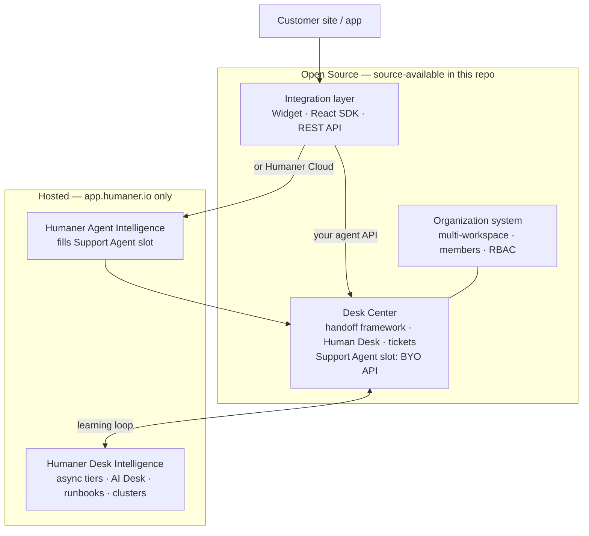

<p align="center">
  <a href="https://humaner.io">Website</a>
  ·
  <a href="https://docs.humaner.io">Docs</a>
  ·
  <a href="https://docs.humaner.io/integrations/api">API</a>
  ·
  <a href="https://github.com/Humaner-inc/humaner">GitHub</a>
  ·
  <a href="https://humaner.io/security">Security</a>
</p>

<p align="center">
  
</p>

---

## Humaner: Customer support that feels human.

We want Customer Support to mean something again. Humaner is the frontier between automation and human care, built for customers, designed for developers.

- **Unique caracters** to suits brand identity and give the human feel people remember.
- **Cross-Session Memory** using metadata and visitoId to go straight to the point and personalize conversations.
- **Human desk** for escalations, ticketing and live support within the same dashboard.
- **Training loop** across the help desk to learn from human behavior and content gaps.

### Open platform + hosted intelligence

Widget, React SDK, REST API, **Organization**, and **Desk Center** (handoff framework, Human Desk, tickets — **bring your own support agent**) are **source-available** in this repo. On Humaner Cloud, **Agent Intelligence** fills the Support Agent slot; **Desk Intelligence** adds async tiers, AI Desk, runbooks, and clusters.



[Full docs →](https://docs.humaner.io) · [Open-source strategy →](./Docs/OPEN_SOURCING.md)

### Built for developer integrations

- **Widget embed:** one-line script, domain allowlist, visitor identify for cross-session memory > [docs](https://docs.humaner.io/integrations/widget).
- **React SDK:** drop-in `<HumanerChat />` with the same auth model as the widget > [docs](https://docs.humaner.io/integrations/react) · [package](./packages/react).
- **REST API:** SSE chat stream, agent metadata, webhooks coming soon > [docs](https://docs.humaner.io/integrations/api).
- **Knowledge-backed agents:** pre-built intelligence across verticals and personalized knowledge through org docs and sites.
- **Human-in-the-loop:** escalate to Human Desk; auto-training from desk conversations on Frontier plan.

## Pricing

- **Classic** (free): 50 messages/mo · 1 agent · Humaner v1.0 (with limitations)
- **Refined:** from $69/mo · 1,000 messages · Humaner v1.0 (full capacity)
- **Frontier:** from $249/mo · 4,000 messages · Humaner v2.0 · live chat · REST API · 3 agents
- **Delegate:** custom · Humaner v3.0 · coming soon.

[Full pricing →](https://humaner.io/pricing)

## Roadmap, issues & feature requests

**Feature requests & bugs:** use the Feedback button in the dashboard sidebar (bottom left).

**Security vulnerabilities:** we appreciate responsible, private disclosure. See [SECURITY.md](./SECURITY.md) · [Security framework](./Docs/SECURITY_FRAMEWORK.md) (published on the public mirror).

### Humaner API & SDK

Integrate Humaner on your site, app, or backend in minutes:

| Surface              | Docs                                                                   | Source in repo                       |
| -------------------- | ---------------------------------------------------------------------- | ------------------------------------ |
| Widget embed         | [integrations/widget](https://docs.humaner.io/integrations/widget)     | `apps/dashboard/public/widget.js`    |
| React component      | [integrations/react](https://docs.humaner.io/integrations/react)       | [`packages/react`](./packages/react) |
| REST API (Frontier+) | [integrations/api](https://docs.humaner.io/integrations/api)           | `apps/dashboard/app/api/v1/`         |
| Webhooks             | [integrations/webhooks](https://docs.humaner.io/integrations/webhooks) | dashboard webhook handlers           |

**Quick embed:**

```html
<script
  src="https://app.humaner.io/widget.js"
  data-agent="YOUR_AGENT_PUBLIC_ID"
  async
></script>
```

**Quick React:**

```tsx
import { HumanerChat } from "@humaner/react";

<HumanerChat agentId="YOUR_AGENT_PUBLIC_ID" position="bottom-right" />;
```

```bash
npm install @humaner/react
```

## Local development

**Most integrators use the hosted API** — no clone required. See [docs](https://docs.humaner.io) to embed in minutes.

This repo is for team members, evaluators, and SDK contributors. See [DEVELOPMENT.md](./DEVELOPMENT.md) for what runs locally vs on Humaner's hosted runtime.

```
apps/
  landing/        → humaner.io        (port 3000)
  documentation/  → docs.humaner.io   (port 3004)
  dashboard/      → app.humaner.io    (port 3001)
packages/
  react/       → @humaner/react
  shared/      → plans, URLs, shared types
```

## Open-source strategy

Humaner follows a **partial open-source** model: ship what operators need to embed and run desk workflows; keep managed intelligence on Cloud:

| Self-host (this repo)                                         | Humaner Cloud                                   |
| ------------------------------------------------------------- | ----------------------------------------------- |
| Widget, React SDK, API, auth, rate limits                     | Everything in OSS, plus managed agent inference |
| Workspaces, members, RBAC                                     | Grounded retrieval, memory, and live data       |
| Desk handoff UI and Human Desk tickets (bring your own agent) | AI Desk, runbooks, clusters, and training gates |

Details: [Docs/OPEN_SOURCING.md](./Docs/OPEN_SOURCING.md)

## Built with

Humaner is built on tools we trust — and several we're proud to share the ecosystem with:

- [Next.js](https://nextjs.org) — dashboard, landing, and widget
- [Anthropic](https://anthropic.com) — Claude models for agent chat (Haiku / Sonnet)
- [OpenAI](https://openai.com) — embeddings for knowledge search and RAG
- [Polar](https://polar.sh) — subscriptions and usage billing
- [Redis](https://redis.io) — LangCache, agent memory, and knowledge search (Redis Iris + Upstash)
- [Firecrawl](https://firecrawl.dev) — knowledge source ingestion (docs and sites)
- [Resend](https://resend.com) — transactional email
- [PostgreSQL](https://www.postgresql.org) — tenant data via Supabase

## License

Source-available under review — license file coming before the repo goes public. `@humaner/react` is [MIT](./packages/react/package.json).
